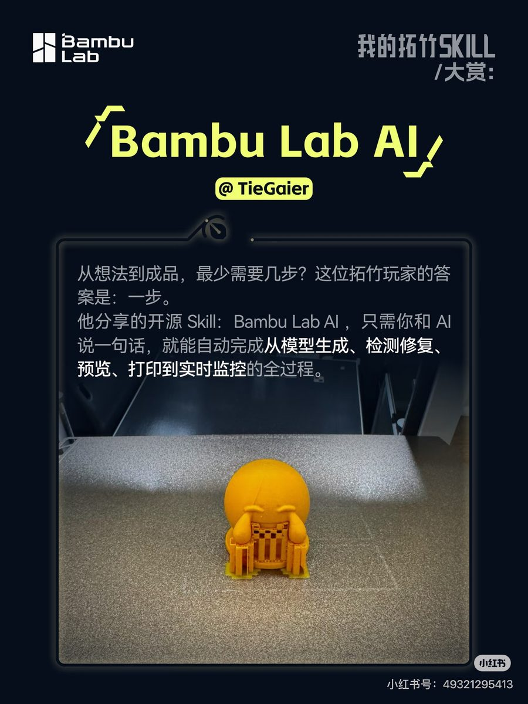
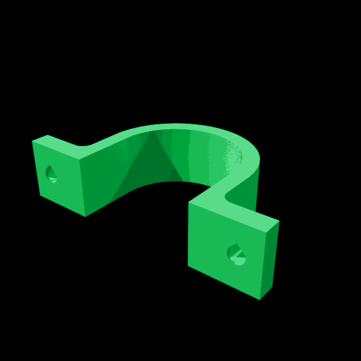
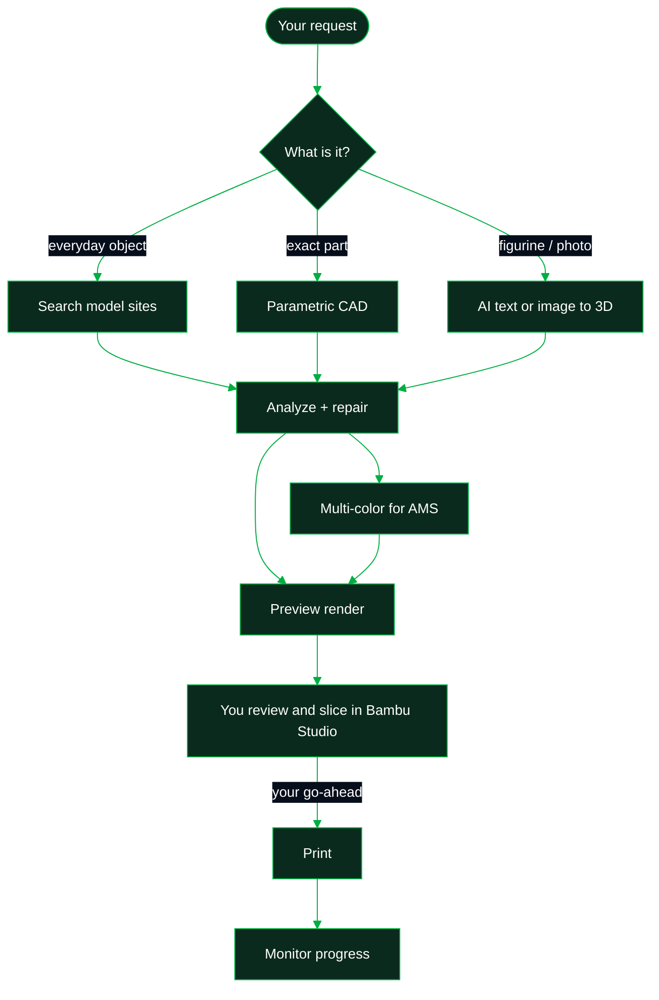

<a id="top"></a>


<div align="center">


<sub>Repository name: <b>Bambu Studio AI</b> (<code>bambu-studio-ai</code>) · <a href="README.zh-CN.md">中文说明</a></sub>

<br><br>

[](https://xhslink.cn/o/6JZRUdwvZdC)
[](https://agentskills.io)
[](https://github.com/heyixuan2/bambu-studio-ai/releases)
[](https://github.com/heyixuan2/bambu-studio-ai/actions/workflows/ci.yml)
[](https://github.com/heyixuan2/bambu-studio-ai/stargazers)
[](LICENSE)
[](#printers-and-requirements)

<br>

**Works with the agent you already use**

[](#get-started)
[![OpenAI Codex](https://img.shields.io/badge/OpenAI_Codex-060E1B?style=for-the-badge&logo=data:image/svg%2bxml;base64,PHN2ZyByb2xlPSJpbWciIHZpZXdCb3g9IjAgMCAyNCAyNCIgeG1sbnM9Imh0dHA6Ly93d3cudzMub3JnLzIwMDAvc3ZnIj48cGF0aCBmaWxsPSIjZmZmIiBkPSJNMjIuMjgyIDkuODIxYTUuOTg1IDUuOTg1IDAgMCAwLS41MTYtNC45MSA2LjA0NiA2LjA0NiAwIDAgMC02LjUxLTIuOUE2LjA2NSA2LjA2NSAwIDAgMCAxMS43MDggMGE2LjA2IDYuMDYgMCAwIDAtNS43OSA0LjIgNS45ODggNS45ODggMCAwIDAtNC4wMDUgMi45MDIgNi4wNTMgNi4wNTMgMCAwIDAgLjc0OCA3LjA5NyA1Ljk4IDUuOTggMCAwIDAgLjUxIDQuOTExIDYuMDUxIDYuMDUxIDAgMCAwIDYuNTE1IDIuOUE1Ljk4NSA1Ljk4NSAwIDAgMCAxMy4yNiAyNGE2LjA1NiA2LjA1NiAwIDAgMCA1Ljc3Mi00LjIwNiA1Ljk5IDUuOTkgMCAwIDAgMy45OTctMi45IDYuMDU2IDYuMDU2IDAgMCAwLS43NDctNy4wNzN6TTEzLjI2IDIyLjQzYTQuNDc2IDQuNDc2IDAgMCAxLTIuODc2LTEuMDRsLjE0MS0uMDgxIDQuNzc5LTIuNzU4YS43OTUuNzk1IDAgMCAwIC4zOTItLjY4MXYtNi43MzdsMi4wMiAxLjE2OGEuMDcxLjA3MSAwIDAgMSAuMDM4LjA1MnY1LjU4M2E0LjUwNCA0LjUwNCAwIDAgMS00LjQ5NCA0LjQ5NHpNMy42IDE4LjMwNGE0LjQ3IDQuNDcgMCAwIDEtLjUzNS0zLjAxNGwuMTQyLjA4NSA0Ljc4MyAyLjc1OWEuNzcxLjc3MSAwIDAgMCAuNzggMGw1Ljg0My0zLjM2OXYyLjMzMmEuMDguMDggMCAwIDEtLjAzMy4wNjJMOS43NCAxOS45NWE0LjUgNC41IDAgMCAxLTYuMTQtMS42NDZ6TTIuMzQgNy44OTZhNC40ODUgNC40ODUgMCAwIDEgMi4zNjYtMS45NzNWMTEuNmEuNzY2Ljc2NiAwIDAgMCAuMzg4LjY3Nmw1LjgxNSAzLjM1NS0yLjAyIDEuMTY4YS4wNzYuMDc2IDAgMCAxLS4wNzEgMGwtNC44My0yLjc4NkE0LjUwNCA0LjUwNCAwIDAgMSAyLjM0IDcuODcyem0xNi41OTcgMy44NTVsLTUuODMzLTMuMzg3TDE1LjExOSA3LjJhLjA3Ni4wNzYgMCAwIDEgLjA3MSAwbDQuODMgMi43OTFhNC40OTQgNC40OTQgMCAwIDEtLjY3NiA4LjEwNXYtNS42NzhhLjc5Ljc5IDAgMCAwLS40MDctLjY2N3ptMi4wMS0zLjAyM2wtLjE0MS0uMDg1LTQuNzc0LTIuNzgyYS43NzYuNzc2IDAgMCAwLS43NzYgMEw5LjQwOSA5LjIzVjYuODk3YS4wNjYuMDY2IDAgMCAxIC4wMjgtLjA2MWw0LjgzLTIuNzg3YTQuNSA0LjUgMCAwIDEgNi42OCA0LjY2em0tMTIuNjQgNC4xMzVsLTIuMDItMS4xNjRhLjA4LjA4IDAgMCAxLS4wMzgtLjA1N1Y2LjA3NWE0LjUgNC41IDAgMCAxIDcuMzc1LTMuNDUzbC0uMTQyLjA4TDguNzA0IDUuNDZhLjc5NS43OTUgMCAwIDAtLjM5My42ODF6bTEuMDk3LTIuMzY1bDIuNjAyLTEuNSAyLjYwNyAxLjV2Mi45OTlsLTIuNTk3IDEuNS0yLjYwNy0xLjV6Ii8+PC9zdmc+)](#get-started)
[](#get-started)
[](#get-started)
[](#get-started)
[](#install-details)

</div>

<br>

<table align="center">
<tr>
<td width="38%" align="center" valign="middle">
<a href="https://xhslink.cn/o/6JZRUdwvZdC"></a>
</td>
<td width="62%" valign="middle">

### Featured by Bambu Lab

Selected for the **first batch of featured works** in Bambu Lab's official
***我的拓竹 Skill 大赏*** (Bambu Lab Player Skill Showcase, 2026), under the name **Bambu Lab AI**.

> *"From an idea to a finished print, what's the fewest number of steps? This Bambu player's answer: one."*
> <br>— Bambu Lab, announcing the featured works

The yellow figure on the poster is a real print, produced end-to-end by this skill.

[**Read the announcement on Xiaohongshu →**](https://xhslink.cn/o/6JZRUdwvZdC)

<sub>Poster © Bambu Lab, from the official announcement.</sub>

</td>
</tr>
</table>

<br>

## What a session looks like

<table>
<tr>
<td width="58%" valign="top">

```text
You    I need a wall bracket for a 32 mm pipe
       with two M4 screw holes. PETG, on my A1.

Agent  That's a precision part, so I'll model it
       to exact dimensions instead of using AI.
       → 32.4 mm clamp bore (0.2 mm clearance/side)
       → 4 mm strap · two 4.2 mm M4 teardrop holes
       → one solid body · fits the A1 plate
       → suggested: 0.2 mm layers · 40% infill
       It's open in Bambu Studio. Slice it and
       tell me if it looks right.

You    Looks good. Starting the print now.

Agent  Print detected. I'll report progress every
       30 minutes and warn you if it stalls.
```

</td>
<td width="42%" align="center" valign="middle">



<sub>The actual output of that session: modelled by <code>parametric.py</code>, rendered by <code>preview.py --views turntable</code>. No retouching.</sub>

</td>
</tr>
</table>

<br>

## Why it's different

<table>
<tr>
<td width="50%" valign="top">

### The right method for each object
Everyday objects: **search** MakerWorld, Printables, Thingiverse and Thangs first, because tested designs beat generated ones. Functional parts: **parametric CAD** with real millimetres and real screw clearances. Figurines, characters and photos: **AI text-to-3D and image-to-3D** across five providers.

</td>
<td width="50%" valign="top">

### Checked before it's printed
Every model, downloaded or generated, passes an **11-point check** before you see it: scale, wall thickness, overhangs, floating fragments, orientation, build volume, and whether the material suits your printer. Then it's **repaired automatically**. Textured models become **AMS-ready multi-color** files with matched Bambu filaments.

</td>
</tr>
<tr>
<td width="50%" valign="top">

### You're always in the loop
You see a **render first**, then review and slice in **Bambu Studio**. The agent **never starts a print without an explicit yes**, and it asks before enabling auto-pause.

</td>
<td width="50%" valign="top">

### Your agent, your printer, your keys
Works with the agent you already use and talks to your printer over **your own network**. API keys live in a **local file only you can read**. No accounts, no relay servers, no telemetry.

</td>
</tr>
</table>

<br>

## Get started

<table>
<tr>
<td width="33%" valign="top">

**1 · Add the skill**

```bash
npx skills add heyixuan2/bambu-studio-ai
```

Detects the agents you have installed. Add `-g` for all projects.
[Manual install ↓](#install-details)

</td>
<td width="33%" valign="top">

**2 · Install Python deps**

```bash
cd <skill folder>
pip install -r requirements.txt
python3 scripts/doctor.py
```

Skill installers copy files but don't install packages. `doctor.py` shows what's optional.

</td>
<td width="33%" valign="top">

**3 · Ask for something**

Search, generation, CAD and analysis work right away.

For printer control, say *"set up my Bambu printer"* and the agent walks you through it in about two minutes.

</td>
</tr>
</table>

<br>

## Things you can ask

| Make something | Check or fix a model | Print and watch |
|---|---|---|
| *"Print me a cute cat figurine, about 6 cm tall"* | *"Why won't this STL slice properly?"* | *"What filament is loaded in my AMS?"* |
| *"Design a 60×40×30 mm electronics box with a lid"* | *"Scale this to 12 cm and check it fits my A1 Mini"* | *"Is my print done?"* |
| *"Turn this photo into a 3D print, in full color"* | *"Make this model 4 colors for my AMS Lite"* | *"Watch this print and pause it if it goes wrong"* |
| *"Find me a good cable organizer on MakerWorld"* | *"Is this OK to print in ABS on a P1S?"* | *"Pause it. What's the nozzle temperature?"* |

<br>

## How it works



The skill is a set of plain Python tools plus a `SKILL.md` playbook that tells the agent when to use
each one and where to stop and ask you. Agents load it only when a 3D-printing task comes up, and
read the detailed references (setup, multi-color, monitoring, troubleshooting) only when a step needs
them.

| Capability | Tool | Details |
|---|---|---|
| Model search | `search.py` | MakerWorld, Printables, Thingiverse, Thangs, deduplicated |
| AI generation | `generate.py` | Meshy, Tripo3D, Printpal, 3D AI Studio, Hyper3D Rodin. Print-aware prompts, scaling to exact height, retries |
| Parametric CAD | `parametric.py` | Brackets, plates with holes, enclosures, arbitrary CSG from JSON. Always watertight, exact to 0.01 mm |
| Printability | `analyze.py` | 11-point check, tiered repair, auto-orientation, unit detection |
| Multi-color | `colorize` | Texture → up to 8 AMS colors, nearest Bambu filament by CIELAB ΔE |
| Preview | `preview.py` | Blender renders and 360° turntable GIFs, size verification |
| Printer | `bambu.py` | Status, AMS, open in Bambu Studio, and more |
| Monitoring | `monitor.py` | Waits for the print to start, progress reports, stall/temperature alerts |
| Setup | `configure.py`, `doctor.py` | Settings and secrets without editing JSON, dependency diagnostics |

<br>

## Printers and requirements

<div align="center">


</div>

All current Bambu Lab printers, with build volumes, temperature limits and material compatibility
built in ([specs](references/model-specs.md)). **Runs on** macOS, Linux and Windows with Python 3.10+.
Optional tools unlock more:

| Tool | Unlocks | Install |
|---|---|---|
| [Bambu Studio](https://bambulab.com/en/download/studio) | Opening models for review and slicing | macOS `brew install --cask bambu-studio` · Windows/Linux installer, AppImage or Flatpak |
| [Blender 4+](https://www.blender.org/download/) | Preview renders, multi-color | macOS `brew install --cask blender` · Linux `snap install blender --classic` · Windows installer |
| ffmpeg | Camera snapshots | `brew install ffmpeg` · `apt install ffmpeg` · `winget install ffmpeg` |
| An AI provider key | Text-to-3D and image-to-3D | Meshy, Tripo3D, Printpal, 3D AI Studio or Rodin ([setup](references/setup.md#ai-generation)) |
| OrcaSlicer, `rembg`, `pymeshlab` | CLI slicing, photo background removal, heavy mesh repair | See `doctor.py` |

<br>

## Privacy and safety

- **Local first.** Printer communication runs over your own network. Nothing goes through a relay.
- **Your secrets stay put.** Access codes and API keys are stored in `~/.bambu-studio-ai/.secrets.json`
  (chmod 600) and are sent only to the service they belong to.
- **Nothing prints by surprise.** `bambu.py print` refuses to run without `--confirmed`, and the
  playbook tells agents to pass it only after your explicit go-ahead.
- Every network endpoint is listed in [references/security.md](references/security.md).

<br>

## Install details

<details>
<summary><b>Manual install (git clone) and per-agent paths</b></summary>
<br>

Clone into your agent's skills folder. The folder must be named `bambu-studio-ai`.

```bash
git clone https://github.com/heyixuan2/bambu-studio-ai.git ~/.claude/skills/bambu-studio-ai
```

| Agent | For all projects | For one project |
|---|---|---|
| Claude Code | `~/.claude/skills/` | `.claude/skills/` |
| OpenAI Codex | `~/.codex/skills/` | `.agents/skills/` |
| Cursor | `~/.cursor/skills/` | `.agents/skills/` |
| Gemini CLI | `~/.gemini/skills/` | `.agents/skills/` |
| GitHub Copilot | `~/.copilot/skills/` | `.agents/skills/` |
| OpenCode | `~/.config/opencode/skills/` | `.agents/skills/` |
| Windsurf | `~/.codeium/windsurf/skills/` | `.windsurf/skills/` |
| Cline | `~/.agents/skills/` | `.agents/skills/` |
| Goose | `~/.config/goose/skills/` | `.goose/skills/` |
| OpenClaw | `~/.openclaw/skills/` | `skills/` |

`.agents/skills/` is shared by most agents, so one project-level clone there covers Codex, Cursor,
Gemini CLI, Copilot, OpenCode, Cline and Amp at once. Update with `npx skills update bambu-studio-ai`
or `git pull`. Your settings live outside the skill folder, so updates never touch them.

</details>

<details>
<summary><b>Claude.ai / Claude Desktop (upload)</b></summary>
<br>

Zip the folder and upload it under Settings → Capabilities → Skills. Search, generation, CAD and
analysis work there. Printer control needs a machine on the same network as the printer, so use a
local agent (Claude Code, Codex, …) for that.

</details>

<details>
<summary><b>Where files go</b></summary>
<br>

| What | Where | Override |
|---|---|---|
| Settings, secrets, cloud token, certificates | `~/.bambu-studio-ai/` | `BAMBU_STUDIO_AI_HOME` |
| Generated models, previews, snapshots, logs | `./bambu-output/` in your working directory | `BAMBU_OUTPUT_DIR` |

</details>

<details>
<summary><b>Using the tools without an agent</b></summary>
<br>

Every tool is a normal CLI with `--help`:

```bash
python3 scripts/search.py "vase" --limit 3
python3 scripts/parametric.py enclosure --width 60 --depth 40 --height 30 --wall 2 --lid -o box.stl
python3 scripts/analyze.py box.stl --orient --repair --material PETG
python3 scripts/preview.py box_oriented.stl --views turntable
python3 scripts/bambu.py open box_oriented.stl
python3 scripts/monitor.py --wait-start 30 --interval 300
```

</details>

<details>
<summary><b>Upgrading from v1.x (OpenClaw)</b></summary>
<br>

- v2 is a standard Agent Skill. The OpenClaw-only install metadata is gone, so install Python
  dependencies with `pip install -r requirements.txt`. OpenClaw still loads the skill.
- Settings moved from the skill folder to `~/.bambu-studio-ai/`. Old files are still read, and
  `python3 scripts/configure.py migrate` moves them.
- Outputs moved from `<skill>/output/` to `./bambu-output/`.
- Python 3.10+ is required (`bambulabs-api` 2.x needs it).

</details>

<br>

## Contributing

```bash
pip install -r requirements-dev.txt
python3 -m pytest -q        # includes SKILL.md spec and link checks
python3 -m ruff check .
```

Help is especially welcome with more generation providers, better mesh repair, recognizing failed
prints from camera snapshots, and testing on Windows and Linux. Conventions are in
[docs/CONVENTIONS.md](docs/CONVENTIONS.md).

<a href="https://github.com/heyixuan2/bambu-studio-ai/graphs/contributors">
  
</a>

<br>

## Version history

| Version | Highlights |
|---|---|
| **2.0.0** | Works with any agent: spec-compliant `SKILL.md`, settings in `~/.bambu-studio-ai/`, `configure.py`, cross-platform Bambu Studio handoff, `monitor.py --wait-start`, config and cloud-login fixes, real L-bracket and enclosure-lid geometry, Python 3.10+ |
| **1.0.2** | X2D support, CI |
| **1.0.0** | `--height` across the pipeline, parametric modeling, test suite |
| **0.23.0** | Multi-color as a package, shared `common.py` |
| **0.22.0** | Colorize v4 (HSV + CIELAB + vertex-color OBJ), Blender previews |
| **0.20.0** | CLI slicing, auto-orient, Rodin provider, signed MQTT |

## License

MIT, see [LICENSE](LICENSE).

<sub>Bambu Studio AI (Bambu Lab AI) is an independent community project by TieGaier, featured by
Bambu Lab but not developed or officially supported by them. "Bambu Lab" and "Bambu Studio" are
trademarks of their respective owner.</sub>

<div align="center">
<br>

**Made with 💚 for the Bambu Lab community** · [back to top ↑](#top)

</div>


