<a id="top"></a>


<div align="center">


<sub>Repository name: <b>Bambu Studio AI</b> (<code>bambu-studio-ai</code>) · <a href="README.zh-CN.md">中文说明</a></sub>

<br><br>

[](https://xhslink.cn/o/6JZRUdwvZdC)
[](https://agentskills.io)
[](https://github.com/heyixuan2/bambu-studio-ai/releases)
[](https://github.com/heyixuan2/bambu-studio-ai/actions/workflows/ci.yml)
[](https://github.com/heyixuan2/bambu-studio-ai/stargazers)
[](LICENSE)
[](#printers-and-requirements)

<br>

**Works with the Agent You Already Use**

[](#get-started)
[![OpenAI Codex](https://img.shields.io/badge/OpenAI_Codex-060E1B?style=for-the-badge&logo=data:image/svg%2bxml;base64,PHN2ZyByb2xlPSJpbWciIHZpZXdCb3g9IjAgMCAyNCAyNCIgeG1sbnM9Imh0dHA6Ly93d3cudzMub3JnLzIwMDAvc3ZnIj48cGF0aCBmaWxsPSIjZmZmIiBkPSJNMjIuMjgyIDkuODIxYTUuOTg1IDUuOTg1IDAgMCAwLS41MTYtNC45MSA2LjA0NiA2LjA0NiAwIDAgMC02LjUxLTIuOUE2LjA2NSA2LjA2NSAwIDAgMCAxMS43MDggMGE2LjA2IDYuMDYgMCAwIDAtNS43OSA0LjIgNS45ODggNS45ODggMCAwIDAtNC4wMDUgMi45MDIgNi4wNTMgNi4wNTMgMCAwIDAgLjc0OCA3LjA5NyA1Ljk4IDUuOTggMCAwIDAgLjUxIDQuOTExIDYuMDUxIDYuMDUxIDAgMCAwIDYuNTE1IDIuOUE1Ljk4NSA1Ljk4NSAwIDAgMCAxMy4yNiAyNGE2LjA1NiA2LjA1NiAwIDAgMCA1Ljc3Mi00LjIwNiA1Ljk5IDUuOTkgMCAwIDAgMy45OTctMi45IDYuMDU2IDYuMDU2IDAgMCAwLS43NDctNy4wNzN6TTEzLjI2IDIyLjQzYTQuNDc2IDQuNDc2IDAgMCAxLTIuODc2LTEuMDRsLjE0MS0uMDgxIDQuNzc5LTIuNzU4YS43OTUuNzk1IDAgMCAwIC4zOTItLjY4MXYtNi43MzdsMi4wMiAxLjE2OGEuMDcxLjA3MSAwIDAgMSAuMDM4LjA1MnY1LjU4M2E0LjUwNCA0LjUwNCAwIDAgMS00LjQ5NCA0LjQ5NHpNMy42IDE4LjMwNGE0LjQ3IDQuNDcgMCAwIDEtLjUzNS0zLjAxNGwuMTQyLjA4NSA0Ljc4MyAyLjc1OWEuNzcxLjc3MSAwIDAgMCAuNzggMGw1Ljg0My0zLjM2OXYyLjMzMmEuMDguMDggMCAwIDEtLjAzMy4wNjJMOS43NCAxOS45NWE0LjUgNC41IDAgMCAxLTYuMTQtMS42NDZ6TTIuMzQgNy44OTZhNC40ODUgNC40ODUgMCAwIDEgMi4zNjYtMS45NzNWMTEuNmEuNzY2Ljc2NiAwIDAgMCAuMzg4LjY3Nmw1LjgxNSAzLjM1NS0yLjAyIDEuMTY4YS4wNzYuMDc2IDAgMCAxLS4wNzEgMGwtNC44My0yLjc4NkE0LjUwNCA0LjUwNCAwIDAgMSAyLjM0IDcuODcyem0xNi41OTcgMy44NTVsLTUuODMzLTMuMzg3TDE1LjExOSA3LjJhLjA3Ni4wNzYgMCAwIDEgLjA3MSAwbDQuODMgMi43OTFhNC40OTQgNC40OTQgMCAwIDEtLjY3NiA4LjEwNXYtNS42NzhhLjc5Ljc5IDAgMCAwLS40MDctLjY2N3ptMi4wMS0zLjAyM2wtLjE0MS0uMDg1LTQuNzc0LTIuNzgyYS43NzYuNzc2IDAgMCAwLS43NzYgMEw5LjQwOSA5LjIzVjYuODk3YS4wNjYuMDY2IDAgMCAxIC4wMjgtLjA2MWw0LjgzLTIuNzg3YTQuNSA0LjUgMCAwIDEgNi42OCA0LjY2em0tMTIuNjQgNC4xMzVsLTIuMDItMS4xNjRhLjA4LjA4IDAgMCAxLS4wMzgtLjA1N1Y2LjA3NWE0LjUgNC41IDAgMCAxIDcuMzc1LTMuNDUzbC0uMTQyLjA4TDguNzA0IDUuNDZhLjc5NS43OTUgMCAwIDAtLjM5My42ODF6bTEuMDk3LTIuMzY1bDIuNjAyLTEuNSAyLjYwNyAxLjV2Mi45OTlsLTIuNTk3IDEuNS0yLjYwNy0xLjV6Ii8+PC9zdmc+)](#get-started)
[](#get-started)
[](#get-started)
[](#get-started)
[](#install-details)

</div>

<br>

<table align="center">
<tr>
<td width="38%" align="center" valign="middle">
<a href="https://xhslink.cn/o/6JZRUdwvZdC"></a>
</td>
<td width="62%" valign="middle">

### Featured by Bambu Lab

Selected for the **first batch of featured works** in Bambu Lab's official
***我的拓竹 Skill 大赏*** (Bambu Lab Player Skill Showcase, 2026), under the name **Bambu Lab AI**.

> *"From an idea to a finished print, what's the fewest number of steps? This Bambu player's answer: one."*
> <br>— Bambu Lab, announcing the featured works

The yellow figure on the poster is a real print, produced end-to-end by this skill.

[**Read the announcement on Xiaohongshu →**](https://xhslink.cn/o/6JZRUdwvZdC)

<sub>Poster © Bambu Lab, from the official announcement.</sub>

</td>
</tr>
</table>

<br>

## What a Session Looks Like

<table>
<tr>
<td width="58%" valign="top">

```text
You    I need a wall bracket for a 32 mm pipe
       with two M4 screw holes. PETG, on my A1.

Agent  That's a precision part, so I'll model it
       to exact dimensions instead of using AI.
       → 32.4 mm clamp bore (0.2 mm clearance/side)
       → 4 mm strap · two 4.2 mm M4 teardrop holes
       → one solid body · fits the A1 plate
       → suggested: 0.2 mm layers · 40% infill
       It's open in Bambu Studio. Slice it and
       tell me if it looks right.

You    Looks good. Starting the print now.

Agent  Print detected. I'll report progress every
       30 minutes and warn you if it stalls.
```

</td>
<td width="42%" align="center" valign="middle">


<sub>The actual output of that session: modelled by <code>parametric.py</code>, rendered by <code>preview.py --views turntable</code>, recoloured from the default blue to Bambu green.</sub>

</td>
</tr>
</table>

<br>

## Why It's Different

<table>
<tr>
<td width="50%" valign="top">

### The Right Method for Each Object
Everyday objects: **search** MakerWorld and Printables first (in about a second, with download counts), because tested designs beat generated ones. Functional parts: **parametric CAD** with real millimetres and real screw clearances. Figurines, characters and photos: **AI text-to-3D and image-to-3D** with Meshy, Tripo or Rodin.

</td>
<td width="50%" valign="top">

### Checked Before It's Printed
Every model, downloaded or generated, goes through **seven measured checks** before you see it: mesh integrity, build volume, floating parts, overhangs, wall thickness, bed contact, and whether the material suits your printer. Small defects are **repaired automatically**, and you get a score with the rubric behind it. Textured models become **AMS-ready multi-color** files with matched Bambu filaments.

</td>
</tr>
<tr>
<td width="50%" valign="top">

### You're Always in the Loop
You see a **render first**, then review, slice and press **Print** yourself in **Bambu Studio**. The agent can watch a print and tell you how it's going, but it **can't start, pause or change one**.

</td>
<td width="50%" valign="top">

### Your Agent, Your Printer, Your Keys
Works with the agent you already use and reads your printer's status over **your own network**, with the printer in its **normal mode**: Bambu Handy and cloud printing keep working. API keys live in a **local file only you can read**. No accounts, no relay servers, no telemetry.

</td>
</tr>
</table>

<br>

## Get Started

**1 · Add the Skill.** It detects the agents you have installed and puts the skill where each one
looks. Add `-g` for all projects, or see the [manual install](#install-details).

```bash
npx skills add heyixuan2/bambu-studio-ai
```

**2 · Install the Python Dependencies.** Skill installers copy files but don't install packages.
`doctor.py` then shows what's installed and what's optional.

```bash
cd <skill folder>                       # e.g. ~/.claude/skills/bambu-studio-ai
python3 -m pip install -r requirements.txt
python3 scripts/doctor.py
```

**3 · Ask for Something.** Search, generation, CAD and analysis work right away. For printer
status, say *"set up my Bambu printer"* and the agent walks you through it in about two minutes.

<br>

## Things You Can Ask

| Make Something | Check or Fix a Model | Print and Watch |
|---|---|---|
| *"Print me a cute cat figurine, about 6 cm tall"* | *"Why won't this STL slice properly?"* | *"What filament is loaded in my AMS?"* |
| *"Design a 60×40×30 mm electronics box with a lid"* | *"Scale this to 12 cm and check it fits my A1 Mini"* | *"Is my print done?"* |
| *"Turn this photo into a 3D print, in full color"* | *"Make this model 4 colors for my AMS Lite"* | *"Watch this print and tell me if anything goes wrong"* |
| *"Find me a good cable organizer on MakerWorld"* | *"Is this OK to print in ABS on a P1S?"* | *"How long is left? What's the nozzle temperature?"* |

<br>

## How It Works

<p align="center"></p>

The skill is a set of plain Python tools plus a `SKILL.md` playbook that tells the agent when to use
each one and where to stop and ask you. Agents load it only when a 3D-printing task comes up, and
read the detailed references (setup, multi-color, monitoring, troubleshooting) only when a step needs
them.

| Capability | Tool | Details |
|---|---|---|
| Model search | `search.py` | MakerWorld and Printables in parallel, with downloads, likes and licence |
| AI generation | `generate.py` | Meshy, Tripo, Hyper3D Rodin. Textured GLB for Bambu Studio 2.7+, stood upright and scaled to the height you ask for; resumable tasks |
| Parametric CAD | `parametric.py` | Brackets, plates with holes, enclosures, arbitrary CSG from JSON. Always watertight, exact to 0.01 mm |
| Printability | `analyze.py` | Seven checks with a published score, tiered repair, auto-orientation, reported unit assumptions |
| Multi-color | `colorize` | Texture → painted Bambu Studio project, up to 8 AMS colors, nearest Bambu filament by CIEDE2000 |
| Preview | `preview.py` | PNG and 360° turntable GIF via Blender, Bambu Studio or a built-in renderer; size check |
| Printer | `bambu.py` | Status, progress and AMS filaments (read-only), open in Bambu Studio |
| Monitoring | `monitor.py` | Waits for the print to start, progress reports, pause / error / HMS / stall alerts |
| Setup | `configure.py`, `doctor.py` | Settings and secrets without editing JSON, dependency diagnostics |

<br>

## Printers and Requirements

<div align="center">


</div>

All 13 Bambu Lab models in Bambu Studio's own printer profiles, from the A1 Mini to the H2D Pro, with build volumes, temperature limits and material compatibility built in ([specs](references/model-specs.md)). **Runs on** macOS, Linux and Windows with Python 3.10+.
Optional tools unlock more:

| Tool | Unlocks | Install |
|---|---|---|
| [Bambu Studio](https://bambulab.com/en/download/studio) | Reviewing, slicing and printing; print-time and filament estimates | macOS `brew install --cask bambu-studio` · Windows/Linux installer, AppImage or Flatpak |
| [Blender 4+](https://www.blender.org/download/) | Nicer preview renders and turntable GIFs | macOS `brew install --cask blender` · Linux `snap install blender --classic` · Windows installer |
| An AI provider key | Text-to-3D and image-to-3D | Meshy, Tripo or Rodin ([setup](references/setup.md#3-ai-generation-optional)) |
| `pymeshlab` | Heavier mesh repair | `pip install pymeshlab` |

<br>

## Privacy and Safety

- **Local first.** Printer status is read over your own network. Nothing goes through a relay.
- **Your secrets stay put.** Access codes and API keys are stored in `~/.bambu-studio-ai/.secrets.json`
  (chmod 600) and are sent only to the service they belong to.
- **Nothing prints by surprise.** The skill has no code that can start, pause or change a print. You
  press Print in Bambu Studio; the printer stays in its normal mode, so Bambu Handy keeps working.
- Every network endpoint is listed in [references/security.md](references/security.md).

<br>

## Install Details

<details>
<summary><b>Manual install (git clone) and per-agent paths</b></summary>
<br>

Clone into your agent's skills folder. The folder must be named `bambu-studio-ai`.

```bash
git clone https://github.com/heyixuan2/bambu-studio-ai.git ~/.claude/skills/bambu-studio-ai
```

| Agent | For all projects | For one project |
|---|---|---|
| Claude Code | `~/.claude/skills/` | `.claude/skills/` |
| OpenAI Codex | `~/.codex/skills/` | `.agents/skills/` |
| Cursor | `~/.cursor/skills/` | `.agents/skills/` |
| Gemini CLI | `~/.gemini/skills/` | `.agents/skills/` |
| GitHub Copilot | `~/.copilot/skills/` | `.agents/skills/` |
| OpenCode | `~/.config/opencode/skills/` | `.agents/skills/` |
| Windsurf | `~/.codeium/windsurf/skills/` | `.windsurf/skills/` |
| Cline | `~/.agents/skills/` | `.agents/skills/` |
| Goose | `~/.config/goose/skills/` | `.goose/skills/` |
| OpenClaw | `~/.openclaw/skills/` | `skills/` |

`.agents/skills/` is shared by most agents, so one project-level clone there covers Codex, Cursor,
Gemini CLI, Copilot, OpenCode, Cline and Amp at once. Update with `npx skills update bambu-studio-ai`
or `git pull`. Your settings live outside the skill folder, so updates never touch them.

</details>

<details>
<summary><b>Claude.ai / Claude Desktop (upload)</b></summary>
<br>

Zip the folder and upload it under Settings → Capabilities → Skills. Search, generation, CAD and
analysis work there. Printer status needs a machine on the same network as the printer, so use a
local agent (Claude Code, Codex, …) for that.

</details>

<details>
<summary><b>Where files go</b></summary>
<br>

| What | Where | Override |
|---|---|---|
| Settings, secrets, monitor state | `~/.bambu-studio-ai/` | `BAMBU_STUDIO_AI_HOME` |
| Generated models, previews, monitor logs | `./bambu-output/` in your working directory | `BAMBU_OUTPUT_DIR` |

</details>

<details>
<summary><b>Using the tools without an agent</b></summary>
<br>

Every tool is a normal CLI with `--help`:

```bash
python3 scripts/search.py "vase" --limit 3
python3 scripts/parametric.py enclosure --width 60 --depth 40 --height 30 --wall 2 --lid -o box.stl
python3 scripts/analyze.py box.stl --repair --material PETG    # prints the file to use next
python3 scripts/preview.py box.stl --views turntable
python3 scripts/bambu.py open box.stl
python3 scripts/monitor.py --wait-start 30 --interval 300
```

</details>

<details>
<summary><b>Upgrading from v1.x (OpenClaw)</b></summary>
<br>

- v2 is a standard Agent Skill. The OpenClaw-only install metadata is gone, so install Python
  dependencies with `pip install -r requirements.txt`. OpenClaw still loads the skill.
- Settings moved from the skill folder to `~/.bambu-studio-ai/`. Old files are still read, and
  `python3 scripts/configure.py migrate` moves them.
- Outputs moved from `<skill>/output/` to `./bambu-output/`.
- Python 3.10+ is required.

</details>

<br>

## License

MIT, see [LICENSE](LICENSE). Profiles and settings files copied from Bambu Studio keep its AGPL-3.0
licence: see [THIRD_PARTY_NOTICES.md](THIRD_PARTY_NOTICES.md).

<sub>Bambu Studio AI (Bambu Lab AI) is an independent community project by TieGaier, featured by
Bambu Lab but not developed or officially supported by them. "Bambu Lab" and "Bambu Studio" are
trademarks of their respective owner.</sub>

<div align="center">
<br>

[back to top ↑](#top)

</div>


