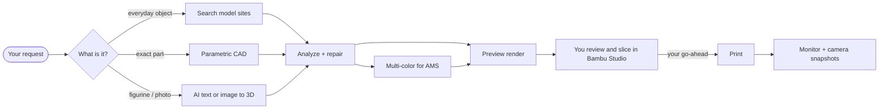

<div align="center">

# Bambu Studio AI

### Tell your AI agent what you need. It designs it, checks it, and gets it printed on your Bambu Lab.

An open-source skill for **Claude Code, OpenAI Codex, Cursor, Gemini CLI, GitHub Copilot** and any
other agent that reads [`SKILL.md`](https://agentskills.io). It finds or creates the model, makes
sure it will actually print, hands it to Bambu Studio for your review, then watches the print.
You stay in control the whole way.

[](https://agentskills.io)
[](https://github.com/heyixuan2/bambu-studio-ai/actions/workflows/ci.yml)
[](LICENSE)
[](#version-history)

</div>

```text
You    I need a wall bracket for a 32 mm pipe with two M4 screw holes. PETG, on my A1.

Agent  That's a precision part, so I'll model it to exact dimensions rather than use AI.
       → 32.3 mm clamp bore (0.3 mm clearance) · 4 mm walls · two 4.2 mm M4 clearance holes
       → printability 9/10 · fits the A1 plate · recommended: 0.2 mm layers, 40% infill, 240 °C
       [preview.png]
       It's open in Bambu Studio. Slice it and tell me if it looks right.

You    Looks good. Starting the print now.

Agent  Print detected. I'll send progress with a camera snapshot every 30 minutes, and warn
       you right away if it stalls or a temperature goes out of range.
```

---

## Why it's different

**🧭 The right method for each object.** Everyday objects: search MakerWorld, Printables,
Thingiverse and Thangs first, because tested designs beat generated ones. Functional parts:
parametric CAD with real millimetres and real screw clearances. Figurines, characters and
photos: AI text-to-3D and image-to-3D across five providers.

**🔍 Checked before it's printed.** Every model, downloaded or generated, goes through an
11-point check before you see it: scale, wall thickness, overhangs, floating fragments,
orientation, build volume, and whether the material suits your printer. Then it's repaired
automatically. Textured models become AMS-ready multi-color files with matched Bambu filaments.

**🙋 You're always in the loop.** You see a render first, then review and slice in Bambu Studio.
The agent never starts a print without an explicit yes, and it asks before enabling auto-pause.

**🔌 Your agent, your printer, your keys.** It works with the agent you already use and talks to
your printer over your own network. API keys live in a local file only you can read. There are
no accounts, no relay servers and no telemetry.

---

## Get started

**1. Add the skill to your agent**

```bash
npx skills add heyixuan2/bambu-studio-ai
```

This detects the agents you have installed and puts the skill in the right place. Add `-g` to
install it for all projects. [Manual install and per-agent paths ↓](#install-details)

**2. Install the Python dependencies** (skill installers copy files but don't install packages)

```bash
cd <skill folder>                        # e.g. ~/.claude/skills/bambu-studio-ai
python3 -m pip install -r requirements.txt
python3 scripts/doctor.py                # tells you what's installed and what's optional
```

**3. Ask for something.** Model search, AI generation, CAD and analysis work right away. For
printer control, say *"set up my Bambu printer"* and the agent walks you through LAN mode, which
takes about two minutes.

---

## Things you can ask

| Make something | Check or fix a model | Print and watch |
|---|---|---|
| *"Print me a cute cat figurine, about 6 cm tall"* | *"Why won't this STL slice properly?"* | *"What filament is loaded in my AMS?"* |
| *"Design a 60×40×30 mm electronics box with a lid"* | *"Scale this to 12 cm and check it fits my A1 Mini"* | *"Is my print done? Show me the camera"* |
| *"Turn this photo into a 3D print, in full color"* | *"Make this model 4 colors for my AMS Lite"* | *"Watch this print and pause it if it goes wrong"* |
| *"Find me a good cable organizer on MakerWorld"* | *"Is this OK to print in ABS on a P1S?"* | *"Pause it. What's the nozzle temperature?"* |

---

## How it works



The skill is a set of plain Python tools plus a `SKILL.md` playbook that tells the agent when to use
each one and where to stop and ask you. Agents load it only when a 3D-printing task comes up, and
read the detailed references (setup, multi-color, monitoring, troubleshooting) only when a step needs
them.

| Capability | Tool | Details |
|---|---|---|
| Model search | `search.py` | MakerWorld, Printables, Thingiverse, Thangs, deduplicated |
| AI generation | `generate.py` | Meshy, Tripo3D, Printpal, 3D AI Studio, Hyper3D Rodin. Print-aware prompts, scaling to exact height, retries |
| Parametric CAD | `parametric.py` | Brackets, plates with holes, enclosures, arbitrary CSG from JSON. Always watertight, exact to 0.01 mm |
| Printability | `analyze.py` | 11-point check, tiered repair, auto-orientation, unit detection |
| Multi-color | `colorize` | Texture → up to 8 AMS colors, nearest Bambu filament by CIELAB ΔE |
| Preview | `preview.py` | Blender renders and 360° turntable GIFs, size verification |
| Printer control | `bambu.py` | Status, AMS, camera, pause/resume/cancel, speed, light, G-code, upload, print. LAN or cloud |
| Monitoring | `monitor.py` | Waits for the print to start, progress reports, stall/temperature alerts, optional auto-pause |
| Setup | `configure.py`, `doctor.py` | Settings and secrets without editing JSON, dependency diagnostics |

---

## Printers and requirements

**All current Bambu Lab printers:** A1 Mini · A1 · P1S · P2S · X1C · X1E · X2D · H2C · H2S · H2D.
Build volumes, temperature limits and material compatibility are built in ([specs](references/model-specs.md)).

**Runs on** macOS, Linux and Windows with Python 3.10+. The following are optional and unlock
more features:

| Tool | Unlocks | Install |
|---|---|---|
| [Bambu Studio](https://bambulab.com/en/download/studio) | Opening models for review and slicing | macOS `brew install --cask bambu-studio` · Windows/Linux installer, AppImage or Flatpak |
| [Blender 4+](https://www.blender.org/download/) | Preview renders, multi-color | macOS `brew install --cask blender` · Linux `snap install blender --classic` · Windows installer |
| ffmpeg | Camera snapshots | `brew install ffmpeg` · `apt install ffmpeg` · `winget install ffmpeg` |
| An AI provider key | Text-to-3D and image-to-3D | Meshy, Tripo3D, Printpal, 3D AI Studio or Rodin ([setup](references/setup.md#ai-generation)) |
| OrcaSlicer, `rembg`, `pymeshlab` | CLI slicing, photo background removal, heavy mesh repair | See `doctor.py` |

---

## Privacy and safety

- **Local first.** Printer control runs over your LAN (MQTT/FTPS/RTSP). Cloud mode is optional.
- **Your secrets stay put.** Access codes and API keys are stored in `~/.bambu-studio-ai/.secrets.json`
  (chmod 600) and never shipped, logged or sent anywhere except the service they belong to.
- **Nothing prints by surprise.** `bambu.py print` refuses to run without `--confirmed`, and the
  playbook tells agents to pass it only after your explicit go-ahead.
- Every network endpoint is listed in [references/security.md](references/security.md).

---

## Install details

<details>
<summary><b>Manual install (git clone) and per-agent paths</b></summary>

Clone into your agent's skills folder. The folder must be named `bambu-studio-ai`.

```bash
git clone https://github.com/heyixuan2/bambu-studio-ai.git ~/.claude/skills/bambu-studio-ai
```

| Agent | For all projects | For one project |
|---|---|---|
| Claude Code | `~/.claude/skills/` | `.claude/skills/` |
| OpenAI Codex | `~/.codex/skills/` | `.agents/skills/` |
| Cursor | `~/.cursor/skills/` | `.agents/skills/` |
| Gemini CLI | `~/.gemini/skills/` | `.agents/skills/` |
| GitHub Copilot | `~/.copilot/skills/` | `.agents/skills/` |
| OpenCode | `~/.config/opencode/skills/` | `.agents/skills/` |
| Windsurf | `~/.codeium/windsurf/skills/` | `.windsurf/skills/` |
| Cline | `~/.agents/skills/` | `.agents/skills/` |
| Goose | `~/.config/goose/skills/` | `.goose/skills/` |
| OpenClaw | `~/.openclaw/skills/` | `skills/` |

`.agents/skills/` is shared by most agents, so one project-level clone there covers Codex, Cursor,
Gemini CLI, Copilot, OpenCode, Cline and Amp at once. Update with `npx skills update bambu-studio-ai`
or `git pull`. Your settings live outside the skill folder, so updates never touch them.

</details>

<details>
<summary><b>Claude.ai / Claude Desktop (upload)</b></summary>

Zip the folder and upload it under Settings → Capabilities → Skills. Search, generation, CAD and
analysis work there. Printer control needs a machine on the same network as the printer, so use a
local agent (Claude Code, Codex, …) for that.

</details>

<details>
<summary><b>Where files go</b></summary>

| What | Where | Override |
|---|---|---|
| Settings, secrets, cloud token, certificates | `~/.bambu-studio-ai/` | `BAMBU_STUDIO_AI_HOME` |
| Generated models, previews, snapshots, logs | `./bambu-output/` in your working directory | `BAMBU_OUTPUT_DIR` |

</details>

<details>
<summary><b>Using the tools without an agent</b></summary>

Every tool is a normal CLI with `--help`:

```bash
python3 scripts/search.py "vase" --limit 3
python3 scripts/parametric.py enclosure --width 60 --depth 40 --height 30 --wall 2 --lid -o box.stl
python3 scripts/analyze.py box.stl --orient --repair --material PETG
python3 scripts/preview.py box_oriented.stl --views turntable
python3 scripts/bambu.py open box_oriented.stl
python3 scripts/monitor.py --wait-start 30 --interval 300
```

</details>

<details>
<summary><b>Upgrading from v1.x (OpenClaw)</b></summary>

- v2 is a standard Agent Skill. The OpenClaw-only install metadata is gone, so install Python
  dependencies with `pip install -r requirements.txt`. OpenClaw still loads the skill.
- Settings moved from the skill folder to `~/.bambu-studio-ai/`. Old files are still read, and
  `python3 scripts/configure.py migrate` moves them.
- Outputs moved from `<skill>/output/` to `./bambu-output/`.
- Python 3.10+ is required (`bambulabs-api` 2.x needs it).

</details>

---

## Contributing

```bash
python3 -m pip install -r requirements-dev.txt
python3 -m pytest -q        # includes SKILL.md spec and link checks
python3 -m ruff check .
```

Help is especially welcome with more generation providers, better mesh repair, recognizing failed
prints from camera snapshots, and testing on Windows and Linux.

## Version history

| Version | Highlights |
|---|---|
| **2.0.0** | Works with any agent: spec-compliant `SKILL.md`, settings in `~/.bambu-studio-ai/`, `configure.py`, cross-platform Bambu Studio handoff, `monitor.py --wait-start`, config and cloud-login fixes, real L-bracket and enclosure-lid geometry, Python 3.10+ |
| **1.0.2** | X2D support, CI |
| **1.0.0** | `--height` across the pipeline, parametric modeling, test suite |
| **0.23.0** | Multi-color as a package, shared `common.py` |
| **0.22.0** | Colorize v4 (HSV + CIELAB + vertex-color OBJ), Blender previews |
| **0.20.0** | CLI slicing, auto-orient, Rodin provider, signed MQTT |

## License

MIT, see [LICENSE](LICENSE).

<sub>Bambu Studio AI is an independent community project. It is not affiliated with or endorsed by
Bambu Lab. "Bambu Lab" and "Bambu Studio" are trademarks of their respective owner.</sub>
