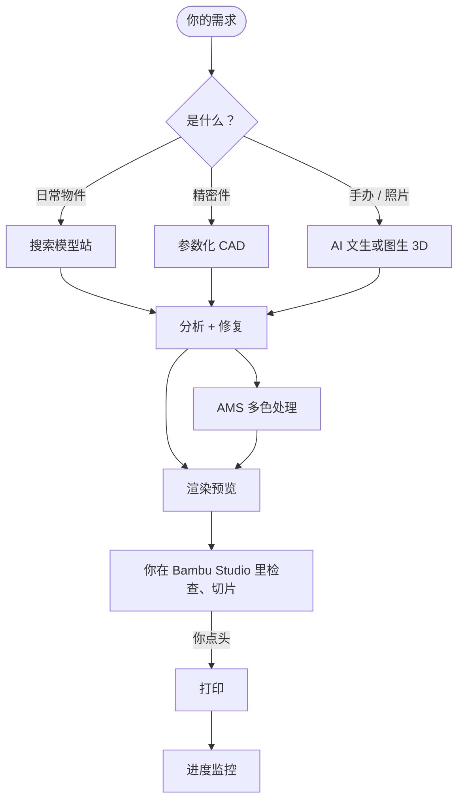

<a id="top"></a>


<div align="center">


<sub>开源仓库名：<b>Bambu Studio AI</b>（<code>bambu-studio-ai</code>）· <a href="README.md">English</a></sub>

<br><br>

[](https://xhslink.cn/o/6JZRUdwvZdC)
[](https://agentskills.io)
[](https://github.com/heyixuan2/bambu-studio-ai/releases)
[](https://github.com/heyixuan2/bambu-studio-ai/actions/workflows/ci.yml)
[](https://github.com/heyixuan2/bambu-studio-ai/stargazers)
[](LICENSE)

<br>

**装进你已经在用的 AI 助手**

[](#三步开始)
[![OpenAI Codex](https://img.shields.io/badge/OpenAI_Codex-060E1B?style=for-the-badge&logo=data:image/svg%2bxml;base64,PHN2ZyByb2xlPSJpbWciIHZpZXdCb3g9IjAgMCAyNCAyNCIgeG1sbnM9Imh0dHA6Ly93d3cudzMub3JnLzIwMDAvc3ZnIj48cGF0aCBmaWxsPSIjZmZmIiBkPSJNMjIuMjgyIDkuODIxYTUuOTg1IDUuOTg1IDAgMCAwLS41MTYtNC45MSA2LjA0NiA2LjA0NiAwIDAgMC02LjUxLTIuOUE2LjA2NSA2LjA2NSAwIDAgMCAxMS43MDggMGE2LjA2IDYuMDYgMCAwIDAtNS43OSA0LjIgNS45ODggNS45ODggMCAwIDAtNC4wMDUgMi45MDIgNi4wNTMgNi4wNTMgMCAwIDAgLjc0OCA3LjA5NyA1Ljk4IDUuOTggMCAwIDAgLjUxIDQuOTExIDYuMDUxIDYuMDUxIDAgMCAwIDYuNTE1IDIuOUE1Ljk4NSA1Ljk4NSAwIDAgMCAxMy4yNiAyNGE2LjA1NiA2LjA1NiAwIDAgMCA1Ljc3Mi00LjIwNiA1Ljk5IDUuOTkgMCAwIDAgMy45OTctMi45IDYuMDU2IDYuMDU2IDAgMCAwLS43NDctNy4wNzN6TTEzLjI2IDIyLjQzYTQuNDc2IDQuNDc2IDAgMCAxLTIuODc2LTEuMDRsLjE0MS0uMDgxIDQuNzc5LTIuNzU4YS43OTUuNzk1IDAgMCAwIC4zOTItLjY4MXYtNi43MzdsMi4wMiAxLjE2OGEuMDcxLjA3MSAwIDAgMSAuMDM4LjA1MnY1LjU4M2E0LjUwNCA0LjUwNCAwIDAgMS00LjQ5NCA0LjQ5NHpNMy42IDE4LjMwNGE0LjQ3IDQuNDcgMCAwIDEtLjUzNS0zLjAxNGwuMTQyLjA4NSA0Ljc4MyAyLjc1OWEuNzcxLjc3MSAwIDAgMCAuNzggMGw1Ljg0My0zLjM2OXYyLjMzMmEuMDguMDggMCAwIDEtLjAzMy4wNjJMOS43NCAxOS45NWE0LjUgNC41IDAgMCAxLTYuMTQtMS42NDZ6TTIuMzQgNy44OTZhNC40ODUgNC40ODUgMCAwIDEgMi4zNjYtMS45NzNWMTEuNmEuNzY2Ljc2NiAwIDAgMCAuMzg4LjY3Nmw1LjgxNSAzLjM1NS0yLjAyIDEuMTY4YS4wNzYuMDc2IDAgMCAxLS4wNzEgMGwtNC44My0yLjc4NkE0LjUwNCA0LjUwNCAwIDAgMSAyLjM0IDcuODcyem0xNi41OTcgMy44NTVsLTUuODMzLTMuMzg3TDE1LjExOSA3LjJhLjA3Ni4wNzYgMCAwIDEgLjA3MSAwbDQuODMgMi43OTFhNC40OTQgNC40OTQgMCAwIDEtLjY3NiA4LjEwNXYtNS42NzhhLjc5Ljc5IDAgMCAwLS40MDctLjY2N3ptMi4wMS0zLjAyM2wtLjE0MS0uMDg1LTQuNzc0LTIuNzgyYS43NzYuNzc2IDAgMCAwLS43NzYgMEw5LjQwOSA5LjIzVjYuODk3YS4wNjYuMDY2IDAgMCAxIC4wMjgtLjA2MWw0LjgzLTIuNzg3YTQuNSA0LjUgMCAwIDEgNi42OCA0LjY2em0tMTIuNjQgNC4xMzVsLTIuMDItMS4xNjRhLjA4LjA4IDAgMCAxLS4wMzgtLjA1N1Y2LjA3NWE0LjUgNC41IDAgMCAxIDcuMzc1LTMuNDUzbC0uMTQyLjA4TDguNzA0IDUuNDZhLjc5NS43OTUgMCAwIDAtLjM5My42ODF6bTEuMDk3LTIuMzY1bDIuNjAyLTEuNSAyLjYwNyAxLjV2Mi45OTlsLTIuNTk3IDEuNS0yLjYwNy0xLjV6Ii8+PC9zdmc+)](#三步开始)
[](#三步开始)
[](#三步开始)
[](#三步开始)
[](#安装细节)

</div>

<br>

<table align="center">
<tr>
<td width="38%" align="center" valign="middle">
<a href="https://xhslink.cn/o/6JZRUdwvZdC"></a>
</td>
<td width="62%" valign="middle">

### 🏆 拓竹官方精选

入选 Bambu Lab 官方「**我的拓竹 Skill 大赏**」**首批精选作品**，官方海报名称为 **Bambu Lab AI**。

> *「从想法到成品，最少需要几步？这位拓竹玩家的答案是：一步。」*
> <br>—— 拓竹官方发布语

海报上那只黄色小人是真实打印件，由这个 skill 从生成到打印全程完成。

[**查看小红书原帖 →**](https://xhslink.cn/o/6JZRUdwvZdC)

<sub>海报 © Bambu Lab 拓竹科技，来自官方发布。</sub>

</td>
</tr>
</table>

<br>

## 💬 一次对话长什么样

<table>
<tr>
<td width="58%" valign="top">

```text
你     我要一个卡 32 mm 水管的墙面支架，两个 M4 螺丝孔，PETG，用 A1 打。

AI     这是精密件，我按精确尺寸建模，不用 AI 生成。
       → 卡口内径 32.3 mm（单边留 0.3 mm 间隙）· 壁厚 4 mm
       → 两个 4.2 mm 的 M4 通孔
       → 可打印性 9/10 · A1 热床放得下
       → 建议：0.2 mm 层高 · 40% 填充 · 240 °C
       [preview.png]
       已经在 Bambu Studio 里打开了，切片看一眼对不对。

你     没问题，我开始打了。

AI     检测到打印开始。每 30 分钟给你一次进度，卡住或温度异常会立刻提醒。
```

</td>
<td width="42%" align="center" valign="middle">


<sub>这段对话的真实产物：<code>parametric.py</code> 建模，<code>preview.py --views turntable</code> 渲染，未经修饰。</sub>

</td>
</tr>
</table>

---

## 它和别的工具有什么不同

**🧭 按对象选方法。** 日常小物件（手机支架、挂钩、理线夹）先搜 MakerWorld、Printables、
Thingiverse、Thangs，因为经过验证的设计比 AI 生成的靠谱。功能件用参数化 CAD，尺寸和螺丝孔
间隙都是真实毫米。手办、角色、照片才交给 AI 文生 3D / 图生 3D，支持五家服务商。

**🔍 打印之前先检查。** 每个模型，不管是下载的还是生成的，都先过 11 项检查：尺寸、壁厚、
悬垂、悬空碎片、摆放方向、成型体积、材料是否适合你的机型，然后自动修复。带贴图的模型
可以转成 AMS 多色文件，并匹配最接近的拓竹耗材颜色。

**🙋 你始终在环。** 先给你看渲染图，再在 Bambu Studio 里由你检查、切片。AI 不会在你没有明确
点头之前开始打印，开启自动暂停之前也会先问你。

**🔌 你的 AI、你的打印机、你的密钥。** 用你已经在用的 AI 助手，密钥只存在本地一个只有你能读的
文件里。没有账号、没有中转服务器、没有遥测。

---

## 三步开始

**1. 把 skill 装进你的 AI 助手**

```bash
npx skills add heyixuan2/bambu-studio-ai
```

它会自动识别你装了哪些 AI 助手并放到正确位置。加 `-g` 装到全局。
[手动安装和各助手的目录 ↓](#安装细节)

**2. 安装 Python 依赖**（skill 安装器只复制文件，不装 Python 包）

```bash
cd <skill 目录>                         # 例如 ~/.claude/skills/bambu-studio-ai
python3 -m pip install -r requirements.txt
python3 scripts/doctor.py               # 检查装了什么、缺什么
```

**3. 直接开口。** 搜模型、AI 生成、参数化建模、可打印性分析马上就能用。要连打印机的话，
跟 AI 说「帮我设置拓竹打印机」，它会一步步带你做。

---

## 你可以这样说

| 做东西 | 检查 / 修模型 | 打印与监控 |
|---|---|---|
| 「给我打一只 6 cm 高的小猫手办」 | 「这个 STL 为什么切片不了？」 | 「AMS 里现在装的什么耗材？」 |
| 「设计一个 60×40×30 mm 带盖的电子盒」 | 「缩放到 12 cm，看看 A1 Mini 放不放得下」 | 「打完了吗？」 |
| 「把这张照片变成彩色 3D 打印件，8 cm 高」 | 「把这个模型做成 4 色给 AMS Lite 用」 | 「帮我盯着这次打印，出问题就暂停」 |
| 「在 MakerWorld 上找个好用的理线器」 | 「这个用 ABS 在 P1S 上打没问题吧？」 | 「暂停一下，喷嘴现在多少度？」 |

---

## 它是怎么工作的



这个 skill 是一组普通的 Python 命令行工具，加上一份 `SKILL.md` 告诉 AI 什么时候用哪个、
哪一步必须停下来问你。AI 只在遇到 3D 打印任务时才加载它，细节文档（设置、多色、监控、
排错）只在需要的那一步才读。

| 能力 | 工具 | 说明 |
|---|---|---|
| 模型搜索 | `search.py` | MakerWorld、Printables、Thingiverse、Thangs，自动去重 |
| AI 生成 | `generate.py` | Meshy、Tripo3D、Printpal、3D AI Studio、Hyper3D Rodin；面向打印优化提示词，按目标高度精确缩放，失败自动重试 |
| 参数化 CAD | `parametric.py` | 支架、带孔底板、外壳、任意 CSG 组合；保证水密，精度 0.01 mm |
| 可打印性 | `analyze.py` | 11 项检查、分级自动修复、自动摆放、单位识别 |
| 多色 | `colorize` | 贴图 → 最多 8 色 AMS，按 CIELAB ΔE 匹配拓竹耗材 |
| 预览 | `preview.py` | Blender 渲染与 360° 转盘 GIF，核对尺寸 |
| 打印机 | `bambu.py` | 状态、AMS、打开 Bambu Studio 等 |
| 监控 | `monitor.py` | 等待打印开始、进度播报、卡住 / 温度异常提醒 |
| 设置 | `configure.py`、`doctor.py` | 不用手改 JSON；依赖诊断 |

---

## 支持的机型与环境

**全部现售拓竹机型：** A1 Mini · A1 · P1S · P2S · X1C · X1E · X2D · H2C · H2S · H2D。
成型体积、温度上限、材料兼容性都内置了（[参数表](references/model-specs.md)）。

**运行环境：** macOS、Linux、Windows，Python 3.10+。以下都是可选的，装了就多一项能力：

| 工具 | 解锁 | 安装 |
|---|---|---|
| [Bambu Studio](https://bambulab.com/zh/download/studio) | 打开模型检查、切片 | 官网安装包 |
| [Blender 4+](https://www.blender.org/download/) | 渲染预览、多色处理 | 官网安装包 / `brew install --cask blender` |
| ffmpeg | 摄像头快照（需开发者模式） | `brew install ffmpeg` · `apt install ffmpeg` · `winget install ffmpeg` |
| AI 服务商密钥 | 文生 3D、图生 3D | Meshy、Tripo3D 等有免费额度（[设置说明](references/setup.md#ai-generation)） |
| OrcaSlicer、`rembg`、`pymeshlab` | 命令行切片、照片去背景、深度修复 | 见 `doctor.py` 输出 |

---

## 隐私与安全

- **本地优先。** 与打印机的通信走你自己的家庭网络，不经过任何第三方服务器。
- **密钥不出门。** 访问码和 API key 存在 `~/.bambu-studio-ai/.secrets.json`（权限 600），
  只会发给它所属的那家服务。
- **不会偷偷开始打印。** `bambu.py print` 没有 `--confirmed` 就拒绝执行，而 SKILL.md 规定
  AI 只能在你明确同意后才加这个参数。
- 所有会联网的端点都列在 [references/security.md](references/security.md)。

---

## 安装细节

<details>
<summary><b>手动安装（git clone）与各助手目录</b></summary>

克隆到你所用助手的 skills 目录，文件夹名**必须**是 `bambu-studio-ai`。

```bash
git clone https://github.com/heyixuan2/bambu-studio-ai.git ~/.claude/skills/bambu-studio-ai
```

| 助手 | 全局 | 单个项目 |
|---|---|---|
| Claude Code | `~/.claude/skills/` | `.claude/skills/` |
| OpenAI Codex | `~/.codex/skills/` | `.agents/skills/` |
| Cursor | `~/.cursor/skills/` | `.agents/skills/` |
| Gemini CLI | `~/.gemini/skills/` | `.agents/skills/` |
| GitHub Copilot | `~/.copilot/skills/` | `.agents/skills/` |
| OpenCode | `~/.config/opencode/skills/` | `.agents/skills/` |
| Windsurf | `~/.codeium/windsurf/skills/` | `.windsurf/skills/` |
| Cline | `~/.agents/skills/` | `.agents/skills/` |
| Goose | `~/.config/goose/skills/` | `.goose/skills/` |
| OpenClaw | `~/.openclaw/skills/` | `skills/` |

大多数助手共用 `.agents/skills/`，在项目里克隆一次就能同时覆盖 Codex、Cursor、Gemini CLI、
Copilot、OpenCode、Cline、Amp。更新用 `npx skills update bambu-studio-ai` 或 `git pull`，
你的设置存在 skill 目录之外，更新不会覆盖。

</details>

<details>
<summary><b>Claude.ai / Claude 桌面版（上传）</b></summary>

把文件夹压缩后在 设置 → Capabilities → Skills 上传。搜索、生成、CAD、分析都能用；
连打印机需要和打印机在同一网络的电脑，请用本地助手（Claude Code、Codex 等）。

</details>

<details>
<summary><b>文件放在哪</b></summary>

| 内容 | 位置 | 覆盖方式 |
|---|---|---|
| 设置、密钥、证书 | `~/.bambu-studio-ai/` | `BAMBU_STUDIO_AI_HOME` |
| 生成的模型、预览图、快照、日志 | 当前目录下的 `./bambu-output/` | `BAMBU_OUTPUT_DIR` |

</details>

<details>
<summary><b>不用 AI 助手，直接用命令行</b></summary>

每个工具都是普通命令行，带 `--help`：

```bash
python3 scripts/search.py "花瓶" --limit 3
python3 scripts/parametric.py enclosure --width 60 --depth 40 --height 30 --wall 2 --lid -o box.stl
python3 scripts/analyze.py box.stl --orient --repair --material PETG
python3 scripts/preview.py box_oriented.stl --views turntable
python3 scripts/bambu.py open box_oriented.stl
python3 scripts/monitor.py --wait-start 30 --interval 300
```

</details>

<details>
<summary><b>从 v1.x（OpenClaw 版）升级</b></summary>

- v2 是标准 Agent Skill，去掉了 OpenClaw 专用的安装元数据，Python 依赖请用
  `pip install -r requirements.txt` 安装。OpenClaw 仍然可以加载。
- 设置从 skill 目录移到了 `~/.bambu-studio-ai/`。旧文件仍会被读取，
  运行 `python3 scripts/configure.py migrate` 可以一键迁移。
- 输出目录从 `<skill>/output/` 改为 `./bambu-output/`。
- 需要 Python 3.10+（`bambulabs-api` 2.x 的要求）。

</details>

---

## 参与贡献

```bash
python3 -m pip install -r requirements-dev.txt
python3 -m pytest -q        # 含 SKILL.md 规范与链接检查
python3 -m ruff check .
```

特别欢迎：更多生成服务商、更好的网格修复、从摄像头画面识别打印失败、Windows / Linux 测试。

## 版本历史

| 版本 | 要点 |
|---|---|
| **2.0.0** | 通用 Agent Skill：符合规范的 `SKILL.md`，设置移至 `~/.bambu-studio-ai/`，`configure.py`，跨平台打开 Bambu Studio，`monitor.py --wait-start`，修复配置读取与云登录 bug，修正 L 型支架与外壳盖几何，Python 3.10+ |
| **1.0.2** | 支持 X2D，CI |
| **1.0.0** | 全流程 `--height`，参数化建模，测试套件 |
| **0.23.0** | 多色模块化，公共 `common.py` |
| **0.22.0** | 多色 v4（HSV + CIELAB + 顶点色 OBJ），Blender 预览 |
| **0.20.0** | 命令行切片、自动摆放、Rodin 服务商、签名 MQTT |

## 许可证

MIT，见 [LICENSE](LICENSE)。

<sub>Bambu Lab AI / Bambu Studio AI 是 TieGaier 的独立社区项目，获拓竹官方精选推荐，但并非拓竹科技
开发或官方支持的产品。"Bambu Lab" 与 "Bambu Studio" 为其所有者的商标。</sub>

<div align="center">
<br>

**为拓竹社区用 💚 制作** · [回到顶部 ↑](#top)

</div>


